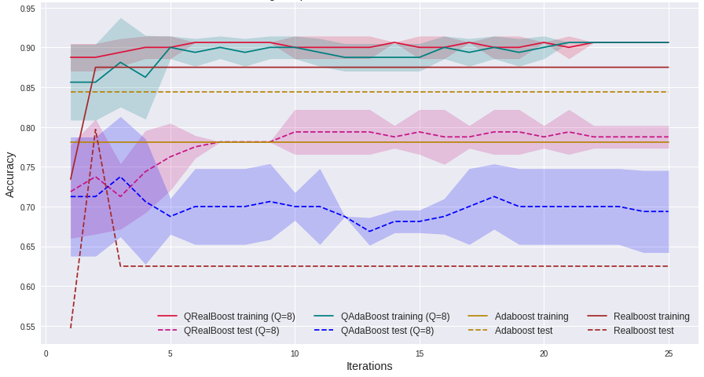
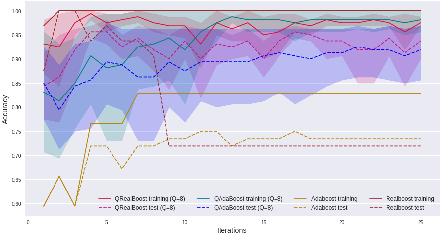

# QRealBoost

Implementation of the QRealBoost algorithm as given in https://arxiv.org/abs/2110.12793.

We compare the generalization ability and convergence of QRealBoost against AdaBoost, RealBoost, and QAdaBoost on the Breast Cancer Wisconsin dataset [1], and the MNIST dataset [2]. The weak learner used here is the classical K-Means clustering also provided by Scikit-Learn [3]. The experiments were performed on Qiskit [4]. Since there does not exist any quantum simulators or actual quantum backends large enough to test QRealBoost, we had to make some interesting choices and changes in the implementation which are detailed below.

- We focus on qualitative analysis behaviour (training and test convergence) of the algorithms in these experiments rather than its efficiency due to the lack of quantum simulators and quantum backends with a sufficient number of qubits.
- Instead of computing the distribution weights from scratch, we store the updated distribution weights after every iteration. This is done because in the former approach the number of qubits needed to store the weights up to a reasonable degree of precision blows up with the number of iterations, taking even experiments with few training samples out of our reach. Even though this choice sacrifices the quantum speedup it does not affect the convergence behaviour of QRealBoost.
- We used a classical weak learner [3] since off-the-shelf quantum weak learners are not readily available right now, and implementing one was out of the scope of this work. The implementation can be easily modified to use any kind of learner implemented as a quantum circuit. We measure the amplified state and pass the top Q training samples to the K-means algorithm. In the paper we pointed out that this is exactly how quantum learners could simulate classical learners.
- We use the the IterativeAmplitudeEstimation class provided by Qiskit which is an implementation of the Iterative Quantum Amplitude Estimation (IQAE) algorithm that replaces quantum phase estimation with clever use of Grover iterations. Our choice was motivated by the availability and performance of the algorithm which helped us decrease the number of qubits needed for the implementation. An important note is the fact that even though the experiments were conducted with additive estimation instead of relative estimation, we still managed to boost the weak learner.

The lines for QAdaBoost and QRealBoost represent a mean accuracy over 5 independent experiments, while the hue bands represent the standard deviation across all experiments. The QAdaBoost and QRealBoost algorithms are tested on quantum simulators (instead of actual quantum backends) due to quantum resource limitations. We set the sample complexity of QAdaBoost and QRealBoost to be 8 for both sets of experiments. All algorithms are trained on 32 samples for both sets of experiments, and we observe the training accuracy and test accuracy over 25 iterations.

In the first experiment (see [BCDataset]), we observe that both QRealBoost and QAdaBoost have similar convergence rates w.r.t. training error that is better than RealBoost and completely dwarfs AdaBoost. Moreover, QRealBoost converges faster than QAdaBoost and has a tighter deviation in training loss over five experiments, especially in the early iterations. Even in terms of generalization ability, QRealBoost completely outperforms QAdaBoost and RealBoost and is only surpassed by AdaBoost.

In the second experiment (see [MNIST]), RealBoost appears to overfit the training samples and suffers from the worst generalization error out of all four algorithms. AdaBoost has a poor convergence rate and generalization error as well. QRealBoost and QAdaBoost perform similarly in training accuracy, with QRealBoost narrowly beating QAdaBoost via faster convergence and a tighter deviation. Regarding generalization abilities, QAdaBoost loses out to QRealBoost in overall test accuracy and deviation over experiments, albeit with a much smaller margin. These are encouraging observations, especially considering that QRealBoost trains on 8 samples at every iteration, while the classical algorithms have access to all the 32 samples every iteration.

## References -

- [1] [Breast Cancer Dataset](https://scikit-learn.org/stable/modules/generated/sklearn.datasets.load_breast_cancer.html)
- [2] [MNIST Dataset](http://yann.lecun.com/exdb/mnist/)
- [3] [K-Means Clustering](https://scikit-learn.org/stable/modules/generated/sklearn.cluster.KMeans.html)
- [4] [Qiskit](https://qiskit.org/)
